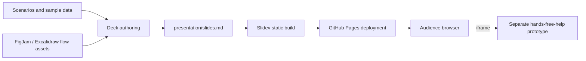

# Design assets and presentation publishing

As-is source baseline: `67bc2625247498c3066d811371221de5e819267b`. Reviewed on 2026-09-17. This describes repository implementation, not verified live deployment state.

This repository contains design materials and a Slidev presentation. Its approval journey is a design proposal, not an implemented approval backend.

## Current architecture and data flow

The deployment workflow builds the presentation into a static artifact and publishes it to Pages. The iframe points outside this repository. Scenario data informs the slides and prototype narrative; it is not ingested by a live agent approval service.

## Source evidence

- [presentation/slides.md](../../presentation/slides.md)
- [presentation/package.json](../../presentation/package.json)
- [.github/workflows/deploy.yml](../../.github/workflows/deploy.yml)
- [scenarios.md](../../scenarios.md)
- [sample-data.json](../../sample-data.json)
- [figjam-flow.mermaid](../../figjam-flow.mermaid)

## Change planning and maintenance

Before planning, read this map and the [project guide](../PROJECT.md), then inspect the linked implementation. For a significant change, add an explicitly labeled **to-be proposal** under this directory or in the design document, link it here, and show the affected boundaries and data flow. Keep proposed behavior separate from this as-is map. Update the current map, source links and review baseline in the same change that implements the behavior; retire or reconcile the proposal after implementation.

The [documentation deployment workflow](../deployment-documentation.md) defines the repository checks and reporting boundary. A structural check can identify missing or changed documentation, but cannot establish that a diagram matches runtime behavior. Human/code review must verify arrows, ownership, persistence and external dependencies.

Diagram maintenance uses `.nexus/diagrams.json` and `scripts/check-diagrams.py`. After reviewing the staged source changes against this map, update the source fingerprint with the shared checker and stage the metadata. The fingerprint records a review boundary, not semantic proof. Nexus tracks source changes and can open refresh PRs through the development/review workflow; updates remain reviewable PR changes, not assumed automatic merges.
